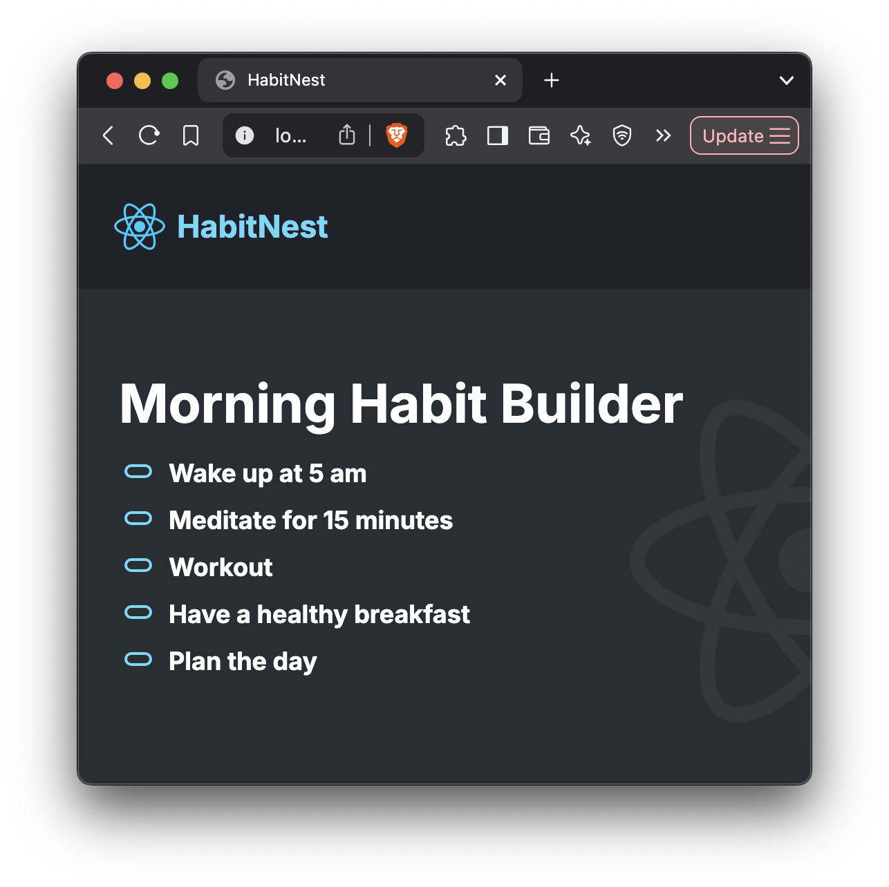
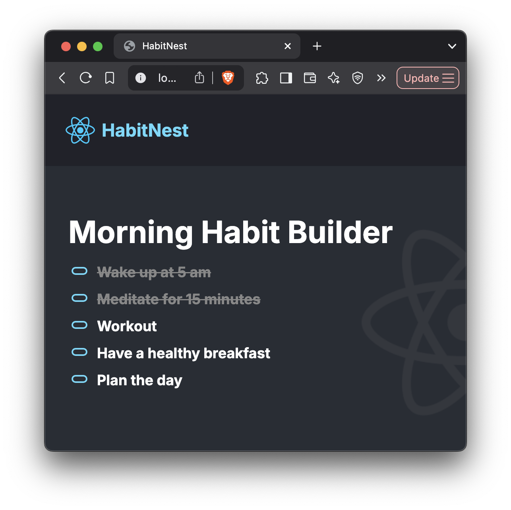

# 🪺 HabitNest

**HabitNest** is a minimalist React application that helps you build and maintain a healthy morning routine. Start your day strong with simple habits like waking up early, meditating, and planning ahead. 🌞

---

## 📸 Preview





---

## 🚀 Features
- 🖥️ Clean and responsive design
- 📋 Simple list of daily habits
- 🌗 Dark-themed interface
- ⚡ Built with lightweight React setup (no backend)

---

## 🛠️ Built With
- [React.js](https://react.dev/)
- [Vite](https://vitejs.dev/)
- HTML5 + CSS3
- JavaScript (ES6+)

---

## 📂 Installation and Setup

First, clone the repository:

```bash
git clone https://github.com/saurin1004/HabitNest.git
cd HabitNest
```

Install the project dependencies:
```bash
npm install
```

Start the development server:
```bash
npm run dev
```

## 🌟 About
HabitNest is built around the idea that small, consistent actions create massive long-term results.
Start your mornings intentionally, track simple positive habits, and set a strong tone for your entire day.

## 📜 License
This project is licensed under the MIT License.

## Made by Saurin Anilkumar Prajapati
